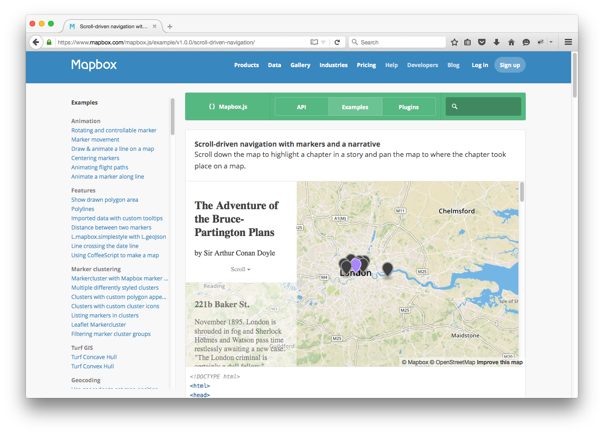
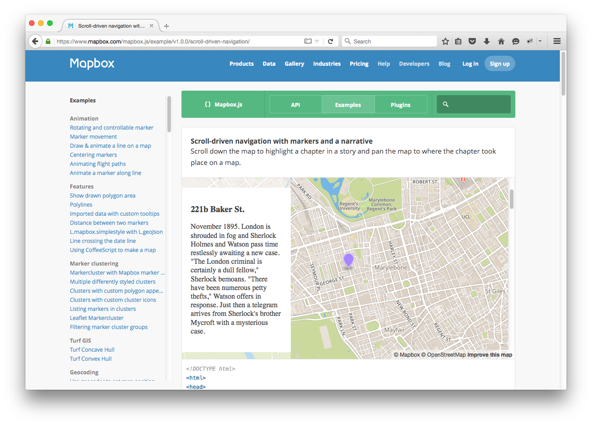
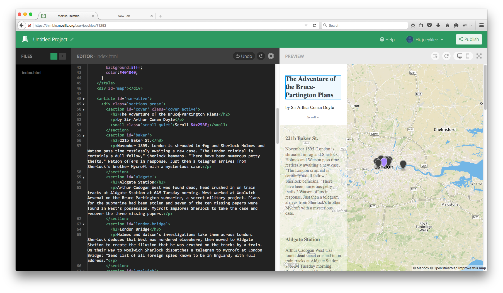
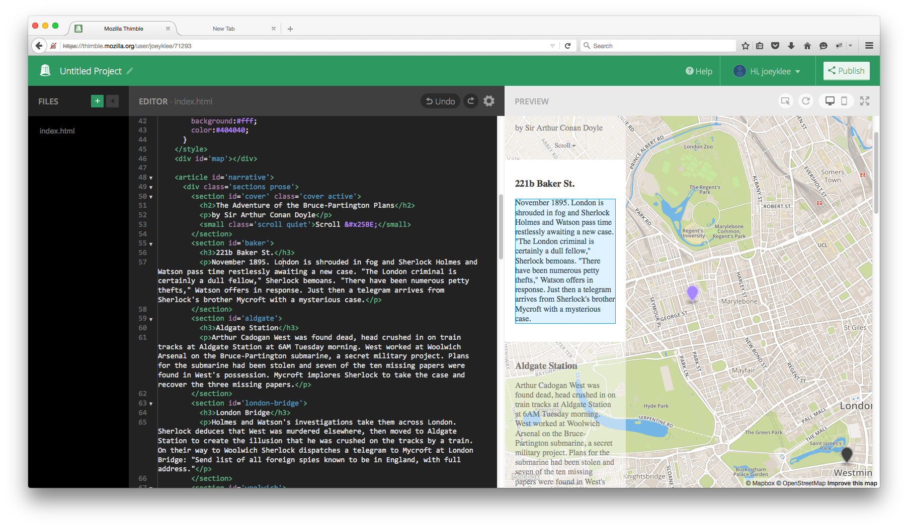
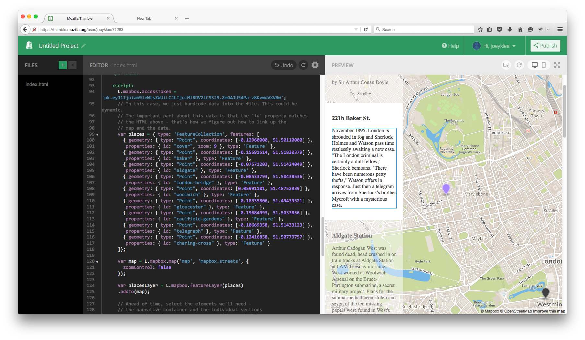
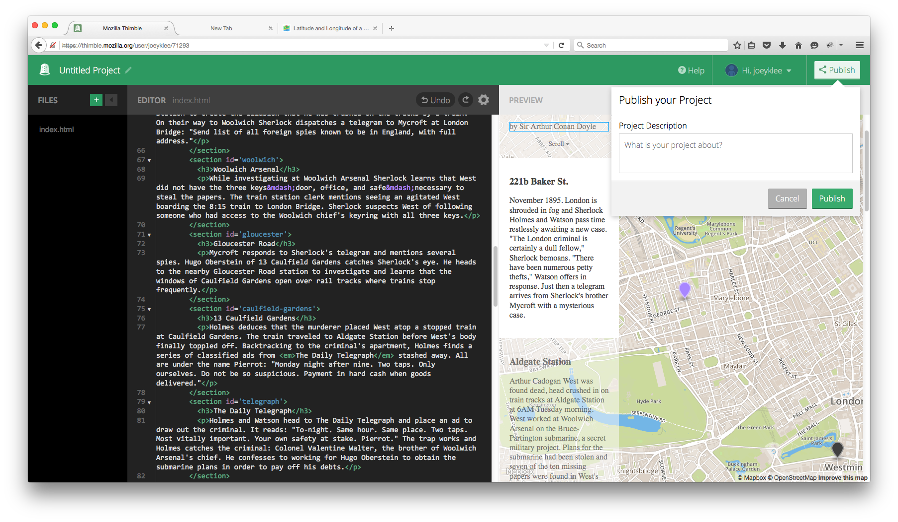
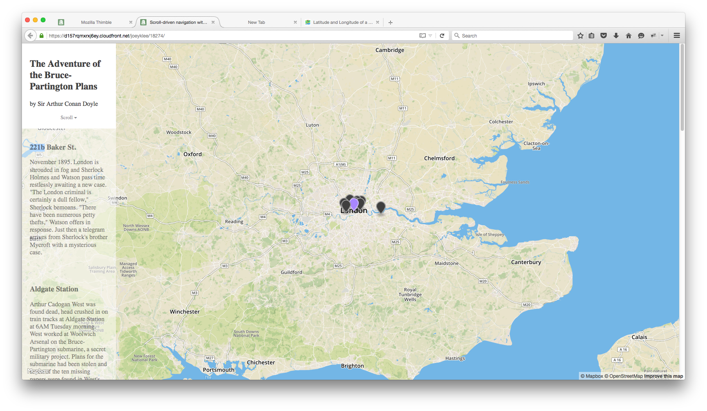

# Scroll-driven Geo Adventure With Mapbox.js

## Overview:
Today we're each going to tell our own geographic story using the web.

**How are we going to do this you ask?**

We will learn how to **remix** the elements of [this html/css/javascript page made using Mapbox.js](https://www.mapbox.com/mapbox.js/example/v1.0.0/scroll-driven-navigation/). 

**Why are we doing this?**

The reason why the web has progressed so quickly is because people have gotten really good at taking other people's html/css/javascript code and building ontop of it. Instead of re-inventing the wheel, we've been able to learn from the work of others. If we can begin deconstructing and reconstructing the elements of other people's web projects, we learn through this process of making and breaking in ways we previously might not have been able to do.

**So let's start!**


## Quick and Dirty explanation of html/css/javascript

Modern webpages consist of html, css, and javascript code. Each has a particular function which are described below:

### html

HTML is the content of the webpage - the text, images, videos, etc. All of this content is contained between "tags" which specify the type of content (e.g. `````` for image, ```<p></p>``` for paragraph, etc.). Perhaps the simplest description of raw html is as a bunch of boxes that contain content.

Metaphor: html is the basic elements of a house - roof, foundation, walls, doors, etc.

### CSS

CSS is the stylesheet for the webpage. This takes all of the html elements - those "boxes" of content - and specifies **where** on the page those elements will go and **what** those elements will look like (e.g. their color, their size, etc). 

Metaphor: css takes the elements of the house - puts them in the right place, gives them color.

### Javascript:

Javascript is a programming language that, among the many things that other programming languages do, adds interacivity to webpages. Javascript adds the ability, for example, to click on buttons, submit forms, etc. 

metaphor: javascript allows you to take your house and open and close doors, make fire in the fireplace, add security systems or garage openers, etc. 


This is a super super super rudimentary explanation of how html/css/javascript interact. If you're keen to find out more, you can check these resources here or simply search the web for more:

* [http://webdesignfromscratch.com/html-css/how-html-css-js-work-together/](http://webdesignfromscratch.com/html-css/how-html-css-js-work-together/)


## Making webpages online 

There are lots of services that allow you to post your html/css/javascript code online so that you can view your webpage update in real time. Some of the major services are:

* [codepen.io](http://codepen.io/)
* [js fiddle](https://jsfiddle.net/)
* [js bin](https://jsbin.com/?html,output)
* [Mozilla Thimble](https://thimble.mozilla.org/)

All these services essentially do the same thing -- they allow you to play with your html/css/javascript code and see how they update your page. This is super handy especially when you're looking for help or feedback on your page. 

We are going to use [Mozilla Thimble](https://thimble.mozilla.org/) because I've found it to have the nicest interface and it has some really nice features - e.g. DOM highlighting - that the other services don't have. 

## Your Geo-Adventure

We will take the code from the mapbox.js's example of [scroll driven navigation](https://www.mapbox.com/mapbox.js/example/v1.0.0/scroll-driven-navigation/). In this example, they use the content from Sherlock Holmes to take us around london as we scroll down the page.

Initial state:


On mouse scroll:



The code:

	<!DOCTYPE html>
	<html>
	<head>
	<meta charset=utf-8 />
	<title>Scroll-driven navigation with markers and a narrative</title>
	<meta name='viewport' content='initial-scale=1,maximum-scale=1,user-scalable=no' />
	<script src='https://api.mapbox.com/mapbox.js/v2.2.3/mapbox.js'></script>
	<link href='https://api.mapbox.com/mapbox.js/v2.2.3/mapbox.css' rel='stylesheet' />
	<style>
	  body { margin:0; padding:0; }
	  #map { position:absolute; top:0; bottom:0; width:100%; }
	</style>
	</head>
	<body>
	<style>
	article {
	  position:absolute;
	  top:0;
	  right:0;
	  bottom:0px;
	  left:0;
	  overflow:auto;
	  }
	.quiet {
	  color:rgba(0,0,0,0.5);
	  }
	.scroll {
	  display:block;
	  text-align:center;
	  }
	.sections {
	  background:rgba(255,255,255,0.5);
	  width:240px;
	  }
	section {
	  padding:20px;
	  color:rgba(0,0,0,0.5);
	  -webkit-transition:background 500ms, color 500ms;
	          transition:background 500ms, color 500ms;
	  }
	section.active {
	  background:#fff;
	  color:#404040;
	  }
	</style>
	<div id='map'></div>
	
	<article id='narrative'>
	  <div class='sections prose'>
	    <section id='cover' class='cover active'>
	      <h2>The Adventure of the Bruce-Partington Plans</h2>
	      <p>by Sir Arthur Conan Doyle</p>
	      <small class='scroll quiet'>Scroll &#x25BE;</small>
	    </section>
	    <section id='baker'>
	      <h3>221b Baker St.</h3>
	      <p>November 1895. London is shrouded in fog and Sherlock Holmes and Watson pass time restlessly awaiting a new case. "The London criminal is certainly a dull fellow," Sherlock bemoans. "There have been numerous petty thefts," Watson offers in response. Just then a telegram arrives from Sherlock's brother Mycroft with a mysterious case.</p>
	    </section>
	    <section id='aldgate'>
	      <h3>Aldgate Station</h3>
	      <p>Arthur Cadogan West was found dead, head crushed in on train tracks at Aldgate Station at 6AM Tuesday morning. West worked at Woolwich Arsenal on the Bruce-Partington submarine, a secret military project. Plans for the submarine had been stolen and seven of the ten missing papers were found in West's possession. Mycroft implores Sherlock to take the case and recover the three missing papers.</p>
	    </section>
	    <section id='london-bridge'>
	      <h3>London Bridge</h3>
	      <p>Holmes and Watson's investigations take them across London. Sherlock deduces that West was murdered elsewhere, then moved to Aldgate Station to create the illusion that he was crushed on the tracks by a train. On their way to Woolwich Sherlock dispatches a telegram to Mycroft at London Bridge: "Send list of all foreign spies known to be in England, with full address."</p>
	    </section>
	    <section id='woolwich'>
	      <h3>Woolwich Arsenal</h3>
	      <p>While investigating at Woolwich Arsenal Sherlock learns that West did not have the three keys&mdash;door, office, and safe&mdash;necessary to steal the papers. The train station clerk mentions seeing an agitated West boarding the 8:15 train to London Bridge. Sherlock suspects West of following someone who had access to the Woolwich chief's keyring with all three keys.</p>
	    </section>
	    <section id='gloucester'>
	      <h3>Gloucester Road</h3>
	      <p>Mycroft responds to Sherlock's telegram and mentions several spies. Hugo Oberstein of 13 Caulfield Gardens catches Sherlock's eye. He heads to the nearby Gloucester Road station to investigate and learns that the windows of Caulfield Gardens open over rail tracks where trains stop frequently.</p>
	    </section>
	    <section id='caulfield-gardens'>
	      <h3>13 Caulfield Gardens</h3>
	      <p>Holmes deduces that the murderer placed West atop a stopped train at Caulfield Gardens. The train traveled to Aldgate Station before West's body finally toppled off. Backtracking to the criminal's apartment, Holmes finds a series of classified ads from <em>The Daily Telegraph</em> stashed away. All are under the name Pierrot: "Monday night after nine. Two taps. Only ourselves. Do not be so suspicious. Payment in hard cash when goods delivered."</p>
	    </section>
	    <section id='telegraph'>
	      <h3>The Daily Telegraph</h3>
	      <p>Holmes and Watson head to The Daily Telegraph and place an ad to draw out the criminal. It reads: "To-night. Same hour. Same place. Two taps. Most vitally important. Your own safety at stake. Pierrot." The trap works and Holmes catches the criminal: Colonel Valentine Walter, the brother of Woolwich Arsenal's chief. He confesses to working for Hugo Oberstein to obtain the submarine plans in order to pay off his debts.</p>
	    </section>
	    <section id='charing-cross'>
	      <h3>Charing Cross Hotel</h3>
	      <p>Walter writes to Oberstein and convinces him to meet in the smoking room of the Charing Cross Hotel where he promises additional plans for the submarine in exchange for money. The plan works and Holmes and Watson catch both criminals.</p>
	      <small class='colophon'>
	        Adapted from <a href='http://www.gutenberg.org/files/2346/2346-h/2346-h.htm'>Project Gutenberg</a>
	      </small>
	    </section>
	  </div>
	</article>
	
	<script>
	L.mapbox.accessToken = 'pk.eyJ1Ijoiam9leWtsZWUiLCJhIjoiMlRDV2lCSSJ9.ZmGAJU54Pa-z8KvwoVXVBw';
	// In this case, we just hardcode data into the file. This could be dynamic.
	// The important part about this data is that the 'id' property matches
	// the HTML above - that's how we figure out how to link up the
	// map and the data.
	var places = { type: 'FeatureCollection', features: [
	{ geometry: { type: "Point", coordinates: [-0.12960000, 51.50110000] },
	  properties: { id: "cover", zoom: 9 }, type: 'Feature' },
	{ geometry: { type: "Point", coordinates: [-0.15591514, 51.51830379] },
	  properties: { id: "baker" }, type: 'Feature' },
	{ geometry: { type: "Point", coordinates: [-0.07571203, 51.51424049] },
	  properties: { id: "aldgate" }, type: 'Feature' },
	{ geometry: { type: "Point", coordinates: [-0.08533793, 51.50438536] },
	  properties: { id: "london-bridge" }, type: 'Feature' },
	{ geometry: { type: "Point", coordinates: [0.05991101, 51.48752939] },
	  properties: { id: "woolwich" }, type: 'Feature' },
	{ geometry: { type: "Point", coordinates: [-0.18335806, 51.49439521] },
	  properties: { id: "gloucester" }, type: 'Feature' },
	{ geometry: { type: "Point", coordinates: [-0.19684993, 51.5033856] },
	  properties: { id: "caulfield-gardens" }, type: 'Feature' },
	{ geometry: { type: "Point", coordinates: [-0.10669358, 51.51433123] },
	  properties: { id: "telegraph" }, type: 'Feature' },
	{ geometry: { type: "Point", coordinates: [-0.12416858, 51.50779757] },
	  properties: { id: "charing-cross" }, type: 'Feature' }
	]};
	
	var map = L.mapbox.map('map', 'mapbox.streets', {
	    zoomControl: false
	});
	
	var placesLayer = L.mapbox.featureLayer(places)
	    .addTo(map);
	
	// Ahead of time, select the elements we'll need -
	// the narrative container and the individual sections
	var narrative = document.getElementById('narrative'),
	    sections = narrative.getElementsByTagName('section'),
	    currentId = '';
	
	setId('cover');
	
	function setId(newId) {
	    // If the ID hasn't actually changed, don't do anything
	    if (newId === currentId) return;
	    // Otherwise, iterate through layers, setting the current
	    // marker to a different color and zooming to it.
	    placesLayer.eachLayer(function(layer) {
	        if (layer.feature.properties.id === newId) {
	            map.setView(layer.getLatLng(), layer.feature.properties.zoom || 14);
	            layer.setIcon(L.mapbox.marker.icon({
	                'marker-color': '#a8f'
	            }));
	        } else {
	            layer.setIcon(L.mapbox.marker.icon({
	                'marker-color': '#404040'
	            }));
	        }
	    });
	    // highlight the current section
	    for (var i = 0; i < sections.length; i++) {
	        sections[i].className = sections[i].id === newId ? 'active' : '';
	    }
	    // And then set the new id as the current one,
	    // so that we know to do nothing at the beginning
	    // of this function if it hasn't changed between calls
	    currentId = newId;
	}
	
	// If you were to do this for real, you would want to use
	// something like underscore's _.debounce function to prevent this
	// call from firing constantly.
	narrative.onscroll = function(e) {
	    var narrativeHeight = narrative.offsetHeight;
	    var newId = currentId;
	    // Find the section that's currently scrolled-to.
	    // We iterate backwards here so that we find the topmost one.
	    for (var i = sections.length - 1; i >= 0; i--) {
	        var rect = sections[i].getBoundingClientRect();
	        if (rect.top >= 0 && rect.top <= narrativeHeight) {
	            newId = sections[i].id;
	        }
	    };
	    setId(newId);
	};
	</script>
	</body>
	</html>


<!--
I've just copied and pasted the code from the mapbox example here but have broken it down.

We start with this tag which tells our web browser that this is an html page: 

	<!DOCTYPE html>

Next we have our opening ```<html>``` tag - this marks the beginning of our webpage

	<html>

Then we have our opening and closing ```<head> </head>``` tag - this element can include a title for the document, scripts, styles, meta information. 

	<head>
	<meta charset=utf-8 />
	<title>Scroll-driven navigation with markers and a narrative</title>
	<meta name='viewport' content='initial-scale=1,maximum-scale=1,user-scalable=no' />
	<script src='https://api.mapbox.com/mapbox.js/v2.2.3/mapbox.js'></script>
	<link href='https://api.mapbox.com/mapbox.js/v2.2.3/mapbox.css' rel='stylesheet' />
	<style>
	  body { margin:0; padding:0; }
	  #map { position:absolute; top:0; bottom:0; width:100%; }
	</style>
	</head>

Notice we have these tags:
	
* ```<title> </title>``` - the title is what you see as your tab label 
* ```<meta> </meta>``` - contains meta info about the function of the page (don't worry about this for now)
* ```<script> </script>```- we're calling in the mapbox.js library so we can use their functions
* ```<link> </link>``` - this calls a reference to the mapbox css stylesheet

Now we have our opening ```<body>``` tag - this starts the main body of the html page.

	<body>
	
The ```<style> </style>``` tags contain the css stylesheet that will control the style of the html elements - e.g. how big the text is, the color of the boxes, etc.

	<style>
	article {
	  position:absolute;
	  top:0;
	  right:0;
	  bottom:0px;
	  left:0;
	  overflow:auto;
	  }
	.quiet {
	  color:rgba(0,0,0,0.5);
	  }
	.scroll {
	  display:block;
	  text-align:center;
	  }
	.sections {
	  background:rgba(255,255,255,0.5);
	  width:240px;
	  }
	section {
	  padding:20px;
	  color:rgba(0,0,0,0.5);
	  -webkit-transition:background 500ms, color 500ms;
	          transition:background 500ms, color 500ms;
	  }
	section.active {
	  background:#fff;
	  color:#404040;
	  }
	</style>
	
We have a ```<div> </div>`` element with an id = 'map'. A div is an html element that is simply a container for other html page elements. This particular div which we've given the id='map' will hold our map tiles

	<div id='map'></div>

Now we have an ```<article> </article>``` tag which **in this very specific example** contains the ```<sections> </sections>``` of content that appear as we scroll on our page. 
	
	<article id='narrative'>
	  <div class='sections prose'>

Each ```<section> </section>``` contains the text you will change.

	    <section id='cover' class='cover active'>
	      <h2>The Adventure of the Bruce-Partington Plans</h2>
	      <p>by Sir Arthur Conan Doyle</p>
	      <small class='scroll quiet'>Scroll &#x25BE;</small>
	    </section>
	    <section id='baker'>
	      <h3>221b Baker St.</h3>
	      <p>November 1895. London is shrouded in fog and Sherlock Holmes and Watson pass time restlessly awaiting a new case. "The London criminal is certainly a dull fellow," Sherlock bemoans. "There have been numerous petty thefts," Watson offers in response. Just then a telegram arrives from Sherlock's brother Mycroft with a mysterious case.</p>
	    </section>
	    <section id='aldgate'>
	      <h3>Aldgate Station</h3>
	      <p>Arthur Cadogan West was found dead, head crushed in on train tracks at Aldgate Station at 6AM Tuesday morning. West worked at Woolwich Arsenal on the Bruce-Partington submarine, a secret military project. Plans for the submarine had been stolen and seven of the ten missing papers were found in West's possession. Mycroft implores Sherlock to take the case and recover the three missing papers.</p>
	    </section>
	    <section id='london-bridge'>
	      <h3>London Bridge</h3>
	      <p>Holmes and Watson's investigations take them across London. Sherlock deduces that West was murdered elsewhere, then moved to Aldgate Station to create the illusion that he was crushed on the tracks by a train. On their way to Woolwich Sherlock dispatches a telegram to Mycroft at London Bridge: "Send list of all foreign spies known to be in England, with full address."</p>
	    </section>
	    <section id='woolwich'>
	      <h3>Woolwich Arsenal</h3>
	      <p>While investigating at Woolwich Arsenal Sherlock learns that West did not have the three keys&mdash;door, office, and safe&mdash;necessary to steal the papers. The train station clerk mentions seeing an agitated West boarding the 8:15 train to London Bridge. Sherlock suspects West of following someone who had access to the Woolwich chief's keyring with all three keys.</p>
	    </section>
	    <section id='gloucester'>
	      <h3>Gloucester Road</h3>
	      <p>Mycroft responds to Sherlock's telegram and mentions several spies. Hugo Oberstein of 13 Caulfield Gardens catches Sherlock's eye. He heads to the nearby Gloucester Road station to investigate and learns that the windows of Caulfield Gardens open over rail tracks where trains stop frequently.</p>
	    </section>
	    <section id='caulfield-gardens'>
	      <h3>13 Caulfield Gardens</h3>
	      <p>Holmes deduces that the murderer placed West atop a stopped train at Caulfield Gardens. The train traveled to Aldgate Station before West's body finally toppled off. Backtracking to the criminal's apartment, Holmes finds a series of classified ads from <em>The Daily Telegraph</em> stashed away. All are under the name Pierrot: "Monday night after nine. Two taps. Only ourselves. Do not be so suspicious. Payment in hard cash when goods delivered."</p>
	    </section>
	    <section id='telegraph'>
	      <h3>The Daily Telegraph</h3>
	      <p>Holmes and Watson head to The Daily Telegraph and place an ad to draw out the criminal. It reads: "To-night. Same hour. Same place. Two taps. Most vitally important. Your own safety at stake. Pierrot." The trap works and Holmes catches the criminal: Colonel Valentine Walter, the brother of Woolwich Arsenal's chief. He confesses to working for Hugo Oberstein to obtain the submarine plans in order to pay off his debts.</p>
	    </section>
	    <section id='charing-cross'>
	      <h3>Charing Cross Hotel</h3>
	      <p>Walter writes to Oberstein and convinces him to meet in the smoking room of the Charing Cross Hotel where he promises additional plans for the submarine in exchange for money. The plan works and Holmes and Watson catch both criminals.</p>
	      <small class='colophon'>
	        Adapted from <a href='http://www.gutenberg.org/files/2346/2346-h/2346-h.htm'>Project Gutenberg</a>
	      </small>
	    </section>
	  </div>

Notice now that our ```<article> </article>``` tag is closed.

	</article>
	
This is our where our javascript begins with our ```<script> </script>``` tags - our javascript is what allows us to **interact** with our html page elements.

	<script>
	L.mapbox.accessToken = '<your access token here>';
	// In this case, we just hardcode data into the file. This could be dynamic.
	// The important part about this data is that the 'id' property matches
	// the HTML above - that's how we figure out how to link up the
	// map and the data.

Notice there's lon/lat coordinates - if we change these, then we can control where our map will scroll. The id's here correspond with the ids of the ```<section> </section>``` elements of our html.

	var places = { type: 'FeatureCollection', features: [
	{ geometry: { type: "Point", coordinates: [-0.12960000, 51.50110000] },
	  properties: { id: "cover", zoom: 9 }, type: 'Feature' },
	{ geometry: { type: "Point", coordinates: [-0.15591514, 51.51830379] },
	  properties: { id: "baker" }, type: 'Feature' },
	{ geometry: { type: "Point", coordinates: [-0.07571203, 51.51424049] },
	  properties: { id: "aldgate" }, type: 'Feature' },
	{ geometry: { type: "Point", coordinates: [-0.08533793, 51.50438536] },
	  properties: { id: "london-bridge" }, type: 'Feature' },
	{ geometry: { type: "Point", coordinates: [0.05991101, 51.48752939] },
	  properties: { id: "woolwich" }, type: 'Feature' },
	{ geometry: { type: "Point", coordinates: [-0.18335806, 51.49439521] },
	  properties: { id: "gloucester" }, type: 'Feature' },
	{ geometry: { type: "Point", coordinates: [-0.19684993, 51.5033856] },
	  properties: { id: "caulfield-gardens" }, type: 'Feature' },
	{ geometry: { type: "Point", coordinates: [-0.10669358, 51.51433123] },
	  properties: { id: "telegraph" }, type: 'Feature' },
	{ geometry: { type: "Point", coordinates: [-0.12416858, 51.50779757] },
	  properties: { id: "charing-cross" }, type: 'Feature' }
	]};
	
	var map = L.mapbox.map('map', 'mapbox.streets', {
	    zoomControl: false
	});
	
	var placesLayer = L.mapbox.featureLayer(places)
	    .addTo(map);
	
	// Ahead of time, select the elements we'll need -
	// the narrative container and the individual sections
	var narrative = document.getElementById('narrative'),
	    sections = narrative.getElementsByTagName('section'),
	    currentId = '';
	
	setId('cover');
	
	function setId(newId) {
	    // If the ID hasn't actually changed, don't do anything
	    if (newId === currentId) return;
	    // Otherwise, iterate through layers, setting the current
	    // marker to a different color and zooming to it.
	    placesLayer.eachLayer(function(layer) {
	        if (layer.feature.properties.id === newId) {
	            map.setView(layer.getLatLng(), layer.feature.properties.zoom || 14);
	            layer.setIcon(L.mapbox.marker.icon({
	                'marker-color': '#a8f'
	            }));
	        } else {
	            layer.setIcon(L.mapbox.marker.icon({
	                'marker-color': '#404040'
	            }));
	        }
	    });
	    // highlight the current section
	    for (var i = 0; i < sections.length; i++) {
	        sections[i].className = sections[i].id === newId ? 'active' : '';
	    }
	    // And then set the new id as the current one,
	    // so that we know to do nothing at the beginning
	    // of this function if it hasn't changed between calls
	    currentId = newId;
	}
	
	// If you were to do this for real, you would want to use
	// something like underscore's _.debounce function to prevent this
	// call from firing constantly.
	narrative.onscroll = function(e) {
	    var narrativeHeight = narrative.offsetHeight;
	    var newId = currentId;
	    // Find the section that's currently scrolled-to.
	    // We iterate backwards here so that we find the topmost one.
	    for (var i = sections.length - 1; i >= 0; i--) {
	        var rect = sections[i].getBoundingClientRect();
	        if (rect.top >= 0 && rect.top <= narrativeHeight) {
	            newId = sections[i].id;
	        }
	    };
	    setId(newId);
	};
	
This is where our javascript ends

	</script>
	
This is where our body tag ends - notice our css ```<style> </style>``` tags and our javascript ```<script> </script>``` tags all live within the ```<body> </body>``` tags. 

	</body>

Here's our final ```<html> </html>``` tag which tells our browser that this is the end of the webpage.

	</html>

-->
	

Let's copy and paste this code into [Mozilla's Thimble](https://thimble.mozilla.org/) and go through each of the elements we will remix in order to tell our own geographic story:

* The Title and author elements:
	* We can change the ```<h2>The Adventure of the Bruce-Partington Plans</h2>``` to something like ```<h2>My Geo Adventure in Vancouver</h2>```
	* We can change the ```<p>by Sir Arthur Conan Doyle</p>``` to your name 



* The section title and content:
	*  Each title indicated by the ```<h3></h3>``` tags can be changed to whatever is the name of the location of the respective section
	* The text in between the ```<p> </p>``` tags can be changed to a description of whatever occured at that location



* The coordinates:
	* you can retrieve the coordinates of the place using [this handy tool](http://itouchmap.com/latlong.html) or [google maps](maps.google.com).
	* remember the coordinates are in longitude, latitude!!!
	* the coordinates have a property called "id" -- this corresponds to the id of the ```<section> </section>``` elements of your content, so make sure the coordinates your paste in correspond accordingly! 




### HAVE FUN AND SHOW US YOUR GEOSTORY! 

## When you've finished: publish!



And see the magic!



## Taking it further:

* add in images into your sections 
* change the color of your section background


<!--**So then where is the html? where's the css? where's the javascript?**

The html, css, and javascript are all together in this one file HOWEVER they are separated by "tags" which tell the web page whether the enclosed code is html code, css code, or javascript code.

For html:

	<body>
		... a bunch of html code...
	</body>

For css:

	<style>
		... a bunch of css code...
	</style>

For Javascript:

	<script>
		... a bunch of javascript code
	</script>
-->
